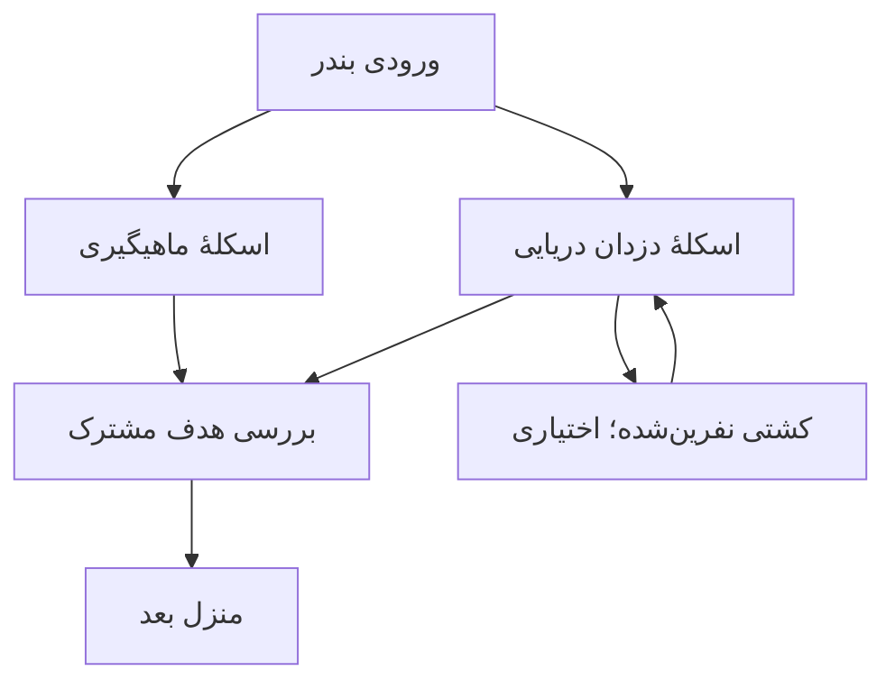

# نقشه، انتخاب مسیر و چالش اختیاری: بررسی نمونه‌ها برای بازی علوم

تاریخ بررسی: ۲۰۲۶/۱۰/۰۲. مخزن: `javedani66-rgb/science-games`. وضعیت: پژوهش و پیشنهاد طراحی؛ هیچ‌یک از مسیرهای پیشنهادی این گزارش پیاده یا منتشر نشده‌اند. مبنای بررسی کد: `7967ddeef8f3bd52279b4c11a77362e769e402e8`.

## نتیجهٔ اصلی برای تصمیم محصول

برای بازی علوم، نقشه‌ای با انتخاب واقعی میان مسیرهای داستانی مناسب به نظر می‌رسد: کودک بتواند وارد کارگاه نجاری یا کارخانهٔ ماشین‌ها شود، در بندر میان اسکلهٔ ماهیگیری و اسکلهٔ دزدان دریایی انتخاب کند و برای چالش بیشتر به شاخه‌ای ویژه برود. نمونه‌های بررسی‌شده اجزای این طراحی را پشتیبانی می‌کنند: انتخاب مرحله با دشواری معلوم، کاوش مکان‌های داستانی، چالش اضافی، کمک قابل انتخاب و بازگشت برای تجربه‌ای تازه. کنار هم قراردادن این اجزا، پیشنهاد اختصاصی برای محصول ماست.

پیشنهاد، حفظ ستون اصلیِ دوازده جلسه و ساخت دوراهی‌های محدود درون هر منطقه است. دو راه زمانی می‌توانند جایگزین یکدیگر باشند که اهداف آموزشی لازم برای مقصد را پوشش دهند. یک چالشِ پیشرفته با موضوع متفاوت، حتی اگر دشوار باشد، جای فعالیت لازم را نمی‌گیرد. عبور با جمع‌آوری سکه، شکست هیولا یا انتخاب ظاهر دشوار، به‌تنهایی مدرک یادگیری نیست.

این گزارش پیش از ممیزی کامل محتوا تهیه شده است. تشخیص اینکه کدام مأموریت موجود به کدام مسیر منتقل شود، به بررسی سؤال‌ها و پیش‌نیازها وابسته است. معیار علمی آن در [گزارش دبستان](../plans/CURRICULUM_LEVELS_PRIMARY_2026-10-02.md) و مرجع توسعهٔ آینده در [گزارش متوسطهٔ اول](../plans/CURRICULUM_LEVELS_LOWER_SECONDARY_2026-10-02.md) آمده است.

## روش و حدود شواهد

شش بازی در سه بررسی موازی مطالعه شدند: دو بازی نینتندو، دو بازی آموزشی و دو نمونه برای انتخاب مسیر یا دشواری اختیاری. عامل اصلی منابع مبنای تحلیل را باز کرد، یافته‌ها را تطبیق داد و وضعیت کد فعلی را خواند. Khan Academy Kids نیز به‌عنوان نمونهٔ تکمیلیِ انتخاب فعالیت بررسی شد.

شواهد شامل مصاحبهٔ توسعه‌دهنده، راهنمای رسمی، معرفی محصول به قلم سازنده و یادداشت‌های انتشار است. نظر کاربران، رتبهٔ فروش و متن نقدها مبنای نتیجه نیستند. بازی‌ها اجرا نشده‌اند؛ بررسی بصریِ کامل نقشه‌های آن‌ها، آزمون کودک و پژوهش اثربخشی آموزشی انجام نشده است. اصلاح ثبت‌شده در یک وصله نشان می‌دهد سازنده آن موضوع را تغییر داده؛ میزان موفقیت اصلاح را ثابت نمی‌کند. معرفی‌های محصول نیز شاهدِ سازوکار اعلام‌شده‌اند، نه تأیید مستقلِ ادعاهای تبلیغاتی.

ارجاع‌های S به منابع رسمی انتهای گزارش مربوط‌اند. «برداشت برای بازی ما» در هر مورد، پیشنهاد طراحی است. نسخهٔ مرجع Wonder بازی اصلی است؛ قابلیت‌های گسترش‌یافتهٔ نسخهٔ Switch 2 بررسی نشده‌اند. یادداشت‌های انتشار Slay the Spire و Celeste شواهد تاریخیِ توسعه‌اند. متن معرفی Prodigy مربوط به ۲۰۲۴ است و دربارهٔ پایان داستان ناسازگاری دارد؛ از آن وضعیت تمام مناطقِ امروز نتیجه نمی‌گیریم.

## نمونه‌های بررسی‌شده

### Super Mario Bros. Wonder: انتخاب دشواری پیش از ورود

**شاهد:** در مصاحبهٔ رسمی، توسعه‌دهندگان می‌گویند بازیکن آماده‌تر می‌تواند مرحلهٔ دشوار و تازه‌کار مرحلهٔ آسان‌تر را انتخاب کند؛ دشواری مرحله اعلام می‌شود. نشان‌های توانایی از شخصیت جدا هستند و بعضی اجرای همان مرحله را آسان‌تر یا دشوارتر می‌کنند. برخی مرحله‌ها با Wonder Seed باز می‌شوند؛ تهیهٔ Seed با سکه نیز ممکن است. [S1]

راهنمای رسمی از راه‌های مخفی به مرحله‌های اضافی، Special World برای آزمودن مهارت بیشتر، ثبت وضعیت جمع‌آوری و بازگشت به مرحله سخن می‌گوید. [S2]

**برداشت برای بازی ما:** در ورودی اسکله، هم ماجرای مسیر و هم نوع چالش را نشان دهیم. کودک آواتار دلخواهش را مستقل از میزان کمک انتخاب کند. همان ابزار علمی می‌تواند با هدف یا محدودیت تازه، فعالیت دشوارتری بسازد. مقصد اصلی آموزشی باید روشن باشد؛ پیداکردن راز و جمع‌آوری جایزه می‌توانند فعالیت افزوده باشند. خرید کلید یا انباشتن امتیاز را به جای پوشش هدف علمی قرار ندهیم.

**حد انتقال:** منابع وجود دو مسیر آموزشیِ هم‌ارز به یک مقصد را اثبات نمی‌کنند. دشواری حرکتیِ یک نشان نیز با دشواری فهم علوم یکسان نیست.

### Yoshi’s Crafted World: بازگشت به محیط آشنا با هدف تازه

**شاهد:** بیشتر مرحله‌ها Front Side و Flip Side دارند؛ روی دیگر، محیط را از منظر تازه نشان می‌دهد و هدف یافتن سه Poochy Pup است. گل‌ها در بازکردن مناطق نقش دارند. Mellow Mode با دادن بال، عبور از مانع را آسان‌تر می‌کند. [S3]

**برداشت برای بازی ما:** بازپخش می‌تواند استفادهٔ تازه‌ای از همان صحنه باشد. یک بار سبد ماهی را بالا بیاوریم؛ بار دیگر آرایش نامناسب طناب را اصلاح کنیم یا برای بار تازه ابزار انتخاب کنیم. کمک ماهیگیر یا نجار در خودِ موقعیت حضور داشته باشد. این کار امکان استفادهٔ دوباره از صحنه و مدل را می‌دهد؛ طراحی هدف، بازخورد و کنترل علمیِ نسخهٔ تازه همچنان ضروری است.

**حد انتقال:** Flip Side شاهد تکرار با هدف دیگر است. از هدف سرعتیِ آن، ضرورت زمان‌سنج یا اعتبارِ سرعت به‌عنوان فهم علمی نتیجه نمی‌گیریم. این مورد شاهد مستقیم دو راه جایگزین روی نقشهٔ آموزشی نیست.

### Prodigy Math: انتخاب مکان، جدا از تعیین سطح سؤال

**شاهد:** معرفی رسمی انتخاب ناحیهٔ نقشه و داستان‌ها و مأموریت‌های مخصوص مناطق را توضیح می‌دهد. پاسخ درست به سؤال ریاضی در نبرد نقش دارد و گزارش آموزشی و نشان مهارت هم معرفی شده‌اند. [S4] صفحهٔ والدین تعیین سطح اولیه و ادامهٔ تنظیم سؤال‌ها بر اساس پیشرفت را توصیف می‌کند. [S5]

**برداشت برای بازی ما:** انتخاب محیط داستانی و تنظیم محتوای علمی را جدا تعریف کنیم. ورود به منطقهٔ دزدان دریایی به معنی «متوسطه‌بودن» کودک نیست. پاداش داستانی، سطح شخصیت و ثبت پوشش هدف آموزشی داده‌های متفاوتی باشند. برای نسخهٔ نخست لازم نیست الگوریتم پیچیدهٔ تعیین سطح بسازیم؛ سطح‌بندیِ دستیِ معتبر و کمک قابل انتخاب نقطهٔ شروع عملی‌تری است.

**حد انتقال:** این منابع کیفیتِ تشخیص آمادگی یا اثربخشی آموزشی را برای ما اثبات نمی‌کنند. انتخاب منطقه هم به معنی وجود دو راه هم‌ارز با مقصد مشترک نیست. پیشنهاد ما این است که چالش علمی مستقیماً مسئلهٔ صحنه را حل کند؛ مثلاً انتخاب قرقره واقعاً صندوق را بالا بیاورد.

### DragonBox Big Numbers: یادگیری در عملِ جهان بازی

**شاهد:** در Noomia، منابع جمع و مبادله می‌شوند تا جهان‌های تازه باز شوند. شش جهان برای کاوش معرفی شده‌اند. پیشروی به جمع و تفریق منابع وابسته است و مقدارها و عملیات با ادامهٔ بازی دشوارتر می‌شوند. [S6]

**برداشت برای بازی ما:** محل و کارِ کودک به هم مربوط باشند. الوار و اهرم در نجاری، طناب و بار در اسکله، و چرخ‌دنده در کارخانه در خدمت حل مسئلهٔ همان مکان قرار گیرند. نام داستانی وقتی مفید است که ابزار، هدف و بازخورد هم به آن تعلق داشته باشند. تصویر باید پیش از خواندن توضیح طولانی، نوع کار را نشان دهد.

**حد انتقال:** چند جهان و پیشروی با منابع مستندند؛ دو شاخهٔ آسان و دشوار با اعتبار آموزشی یکسان، قواعد دقیق تکرار مرحله و سنجش حل مستقل از این صفحه نتیجه نمی‌شوند. بزرگ‌ترکردن عددها فقط یکی از راه‌های افزایش دشواری است و برای سؤال‌های علوم باید تناسب مفهوم بررسی شود.

### Slay the Spire: انتخاب مسیر با تفاوت واقعی و نقشهٔ قابل خواندن

**شاهد:** توضیح رسمی سازنده، انتخاب راه امن یا پرریسک و رویارویی‌های متفاوت را جزئی از بازی معرفی می‌کند. [S7] در وصلهٔ ۵۳، رفتن روی نشان راهنمای نقشه، اتاق‌های هم‌نوع را برجسته می‌کند. [S8] نسخهٔ ۲٫۰ جای نمایش توضیح نشان‌ها را ثابت کرده تا نقشه را نپوشانند. [S9]

**برداشت برای بازی ما:** مسیرها در میزان کمک، ترکیب ابزارها یا تعداد تصمیم‌ها تفاوت داشته باشند. کودک پیش از ورود بداند چه نوع فعالیتی پیش روست. روی موبایل، لمس نشان باید همان اطلاعاتی را بدهد که در رایانه با قرارگرفتن اشاره‌گر دیده می‌شود؛ تصمیم ضروری نباید وابسته به hover باشد. توضیح کوتاه می‌تواند در بخشی ثابت از پایین صفحه ظاهر شود تا دوراهی دیده بماند.

**حد انتقال:** این بازی مرجع ساختار انتخاب است، نه توصیهٔ بازی برای گروه سنی ما. نقشهٔ تصادفی و پیامدهای ریسک را عیناً وارد محصول آموزشی نمی‌کنیم. پیشنهاد ما این است که امتحان مسیر سخت، پیشرفت قبلی و امکان ادامهٔ کودک را از بین نبرد؛ این آزادی برگشت را به Slay the Spire نسبت نمی‌دهیم.

### Celeste: چالش افزوده و فرصت دوبارهٔ روشن

**شاهد:** معرفی سازنده فصل‌های دشوارتر B-side و بازگشت سریع پس از شکست را توضیح می‌دهد. [S10] یادداشت نسخهٔ ۱٫۳٫۰٫۰ روشن‌ترشدن نشان checkpoint، توضیح گزینهٔ برگشت به نقشه با تصویر دورترین checkpoint و حذف عنوان «Give Up» از زیرمنوهای برگشت و شروع دوباره را ثبت کرده است. Assist Mode نیز در یادداشت‌های رسمی حضور دارد. [S11]

**برداشت برای بازی ما:** پس از تلاش ناموفق، اجرای دوبارهٔ همان آزمایش نزدیک و واضح باشد. خروج از مسیر دشوار با پیامِ دقیق دربارهٔ محل ادامه و داده‌های حفظ‌شده همراه شود. «برگرد به نقشه» یا «راه دیگری را امتحان کن» برای این عمل مناسب‌اند. راهنما در چالش هیولا هم در دسترس بماند و استفاده از آن در گزارش از حل مستقل جدا ثبت شود.

**حد انتقال:** B-sideها شاهد محتوای دشوارترند؛ به‌تنهایی جایگزینیِ فصل اصلی یا هم‌ارزی آموزشی را ثابت نمی‌کنند. دقت و سرعتِ اجرای حرکت را به سنجش فهم علوم تبدیل نمی‌کنیم.

### نمونهٔ تکمیلی: Khan Academy Kids

راهنمای رسمی، دکمهٔ بزرگ آغاز مسیر یادگیری و کتابخانه‌ای برای انتخاب فعالیت را کنار هم توضیح می‌دهد؛ محتوای مسیر با عملکرد کودک تنظیم می‌شود. [S12] این نمونه، نقشهٔ چندشاخه نیست. برداشت برای ما این است که «ادامهٔ پیشنهادی» و «انتخاب آزاد» می‌توانند هم‌زمان وجود داشته باشند؛ کودک لازم نیست برای شروع، کل نقشه را تحلیل کند.

## چه چیزهایی از مقایسه به دست آمد؟

آزادیِ مفید باید در فعالیت واقعی دیده شود. اگر دو مسیر فقط تصویر متفاوت داشته باشند و همان ترتیب سؤال را بدهند، دامنهٔ انتخاب محدود به ظاهر می‌ماند. در بازی ما مسیرِ همراه با ماهیگیر می‌تواند نخست یک آزمایش هدایت‌شده بدهد و مسیر دزدان دریایی از کودک بخواهد ابزار یا آرایش طناب را خودش انتخاب کند. تفاوت باید در پروندهٔ محتوا ثبت شود تا بعداً معلوم باشد هر راه کدام هدف را پوشش می‌دهد.

هم‌زمان، نام داستانی، دشواری و وضعیتِ بازبودن سه پیام متفاوت‌اند. «اسکلهٔ دزدان دریایی» موضوع ماجرا را می‌رساند؛ نشان چالش مقدار دشواری پیشنهادی را؛ قفل، نبود پیش‌نیاز را. نشانهٔ انجام‌شدن یا محل فعلی هم باید مستقل باشد. حاشیهٔ قرمز و هیولا یک پیشنهاد بصری برای ماست، نه نتیجهٔ آزموده‌شدهٔ منابع. راهنمای دسترس‌پذیری توصیه می‌کند اطلاعات ضروری علاوه بر رنگ با شکل، نماد یا متن منتقل شوند. [S13]

برای خوانایی، نقشه باید محل فعلی، انتخاب‌های در دسترس و مسیر رسیدن به مقصد را نشان دهد. شرح کوتاهِ کار می‌تواند با لمس گره دیده شود؛ «سبد را بالا بیاور» از عنوانِ صرفِ «قرقره» عمل را روشن‌تر می‌کند. راهنمای عمومی بازی‌ها نیز شروع با منوهای کم‌تر، هدفِ یادآوری‌پذیر، کنترل‌های درشت و فاصله‌دار، و تمرین بدون شکست را توصیه می‌کند. [S14] مناسب‌بودن دقیقِ زبان و اندازه برای کودک فارسی‌زبان همچنان باید در نمونهٔ واقعی سنجیده شود.

| سازوکار | شاهد نزدیک | پیشنهاد برای بازی ما | مرز انتقال |
|---|---|---|---|
| انتخاب آسان‌تر یا دشوارتر | Wonder | انتخاب در ورودی منطقه، پیش از مأموریت | دشواری علمی را جدا ممیزی کنیم |
| مکان با مأموریت مخصوص | Prodigy | اسم و تصویر متناسب با کار واقعی | پاداش شخصیت معادل یادگیری نباشد |
| عمل آموزشی در جهان بازی | Big Numbers | قرقره واقعاً مسئلهٔ حمل بار را حل کند | مدل فیزیکی و بازخورد معتبر لازم است |
| بازپخش با هدف تازه | Yoshi | مسئلهٔ تازه در صحنهٔ آشنا | اجرای دوبارهٔ همان نمونه هم حفظ شود |
| راهنمای خواندن نقشه | Slay the Spire | نشانهٔ نوع فعالیت و توضیح بدون پوشاندن مسیر | نقشهٔ بزرگ و تصادفی برای نمونهٔ نخست نسازیم |
| چالش اضافه و برگشت روشن | Celeste | هیولا اختیاری؛ تکرار و خروج نزدیک | خطا ذخیرهٔ پیشرفت را پاک نکند |

## تطبیق با بازی موجود

کد `journey.js` در مبنای بررسی، نقشهٔ دوازده منزل با پیشروی ترتیبی می‌سازد. `stopSheet` مأموریت‌های اصلی را به‌ترتیب باز می‌کند؛ مأموریت جانبی در `sideSheet` و گرهٔ `data-side` فقط پس از پایان مأموریت‌های منزل باز می‌شود. بنابراین مسیر جانبی فعلی، مسیر جایگزینِ رسیدن به منزل بعد نیست. این تفاوت را نمی‌توان با تغییر نام و رنگ حل کرد.

از طرف دیگر، آزمایش آزاد، بازپخش منزل و مأموریت، گرهٔ جانبی، نشان و شناسه‌های پایدار از قبل وجود دارند. این اجزا امکان استفادهٔ مجدد دارند. نقص تکرار پس از نمایش راه‌حل و تفکیک شواهد در [ممیزی قبلی](../archive/GAME_LEVEL_REPLAY_AUDIT_2026-10-02.md) ثبت شده است؛ نقشهٔ تازه آن کار را حذف نمی‌کند.

یک تعارض بصری مشخص هم وجود دارد: حاشیهٔ قرمزِ گرهٔ فعلی در `jmap` اکنون برای «تو اینجایی» استفاده می‌شود. اگر قرمز معنی چالش خیلی سخت بگیرد، نشانهٔ مکان کودک باید مستقل و واضح شود؛ مثلاً آواتار و نشان مکان. تخصیص نهایی رنگ به بازبینی بصری نیاز دارد.

تصویر ارسالی کاربر از پنجرهٔ «منزل ۱: نیرو» نیز نشان می‌دهد عنوان موضوع، دکمهٔ کم‌رنگِ شروع و قفل جانبی به توضیح روشن‌تری نیاز دارند. تحلیل تصویر، مشاهدهٔ رابط است؛ شاهد آزمون کودک نیست. بازطراحی باید از فهرست عنوان‌ها به نمایشِ مقصدِ فعالیت برسد، با دلیلِ قابل دیدن برای هر قفل.

## ساختار پیشنهادی برای نخستین نمونه: بندر

این ساختار پیشنهاد طراحی است؛ مثال‌ها هنوز سطح‌بندی نشده‌اند. هدف هر پایه و برابریِ پوشش دو مسیر باید در ممیزی بعدی تعیین شود.

«بررسی هدف مشترک» در نمودار قراردادِ اعتبار پیشروی است و لزوماً صفحه یا آزمون جداگانهٔ تازه نمی‌خواهد. اگر فعالیت‌های مسیر هدف را نشان داده‌اند، همان شواهد کافی‌اند. پرسشِ کنترل فقط برای هدفِ پوشش‌داده‌نشده یا نیاز مشخص ساخته شود.

| مکان | فعالیتِ نمونه | کمک و دشواری | اثر پیشنهادی بر پیشرفت |
|---|---|---|---|
| اسکلهٔ ماهیگیری | بالا‌آوردن سبد با ابزار معرفی‌شده | همراهی ماهیگیر و تغییر یک عامل | پوشش هدفِ مناسب پایه |
| اسکلهٔ دزدان دریایی | انتخاب ابزار یا آرایش طناب برای صندوق | تصمیم مستقل‌تر و کمک اختیاری | همان اعتبار، در صورت پوشش همان هدف |
| کشتی نفرین‌شده | ترکیب ابزارهای آموخته‌شده برای نجات محموله | چالش ویژه با نشان هیولا | هدف افزوده و جایزهٔ مستقل؛ شرط عبور نیست |
| گوشهٔ آزمایش آزاد | تغییر بار و آرایش و دیدن نتیجه | بدون امتیاز و جریمه | تمرین؛ به‌خودی‌خود مدرک تسلط نیست |

ورود به مسیر سخت با آزمایش و آموزشِ کوتاه ممکن باشد؛ برچسب توانایی ثابت برای کودک نسازیم. اگر مفهوم خارج از پایه به کار می‌رود، آن را با پیش‌نیاز و آموزشِ افزوده مشخص کنیم. دلیل قفل علمی باید همان پیش‌نیاز باشد، نه جمع‌آوری تزئینات یا خرید. مسیرهای موازی برای نمونهٔ نخست کنار هم قابل دیدن باشند تا کودک انتخابش را بفهمد؛ شاخهٔ ویژه می‌تواند پس از آموزش ابزارها باز شود.

## قرارداد پیشنهادی محتوا و پیشرفت برای دستیار بعدی

پیش از رسم نقشه یا انتقال سؤال، برای هر فعالیت این اطلاعات ثبت شود:

| داده | چیزی که باید معلوم باشد |
|---|---|
| شناسه | شناسهٔ پایدارِ فعالیت موجود یا تازه؛ مستقل از اسم داستانی |
| هدف و شاهد | مفهوم، پایه، پیش‌نیاز و ارجاع کتاب؛ یا برچسب کاوش افزوده |
| دشواری | دشواری مفهومی، محاسباتی، خواندن و کار با کنترل‌ها به‌صورت جدا |
| جای نقشه | منطقه، مسیر، مقصد و امکان ورود/برگشت |
| اعتبار عبور | کدام هدف لازم را پوشش می‌دهد؛ کدام جایزه فقط جانبی است |
| کمک و تکرار | پیش‌بینی، پاسخ مستقل، راهنما، نمایش حل، تمرین همان نمونه و نمونهٔ تازه |
| ذخیره | حفظ دادهٔ قدیمی، امکان ادامه و جلوگیری از امتیاز تکراری |

انجام یک مسیر جایگزین باید فقط اهدافِ پوشش‌داده‌شده را کامل کند. از وضعیت «پایان‌یافته» به‌تنهایی تسلط مستقل نتیجه نگیریم. مرور دوباره می‌تواند رکورد بهتر بسازد، اما امتیاز قبلی را چند بار به جمع اضافه نکند. گزارش معلم باید مسیر انتخاب‌شده و نوع کمک را در کنار نتیجه نگه دارد. تغییر شمار مأموریت‌ها یا جای آن‌ها به بررسی قالب کد پیشرفت و مهاجرت نیاز دارد؛ دادهٔ قبلی بدون شاهد به مسیر تازه نسبت داده نشود.

## ترتیب اقدام و معیار بررسی نمونه

۱. ممیزی کامل محتوای موجود، شامل مأموریت، آزمون، بی‌پایان، آزمایش آزاد و تکلیف خانه؛ مشخص‌کردن هدف‌ها و چهار نوع دشواری. سپس تعیین کنیم چه محتوایی برای بندر آماده است و چه کمبودی دارد.

۲. نمونهٔ نقشه و پنجرهٔ ورود یک منطقه، با دو مسیر و یک شاخهٔ ویژه. در این مرحله اسم‌ها، تصویرِ کار، وضعیت قفل، نشانهٔ سختی و مقصد مشترک بررسی شوند. ساخت کل نقشه پیش از روشن‌شدن این نمونه توصیه نمی‌شود.

۳. پیاده‌سازی قرارداد مسیر و تکرار با حفظ ذخیره‌ها. بررسی‌های هدفمندِ مسیر جایگزین، برگشت، ادامه پس از بارگذاری، کمک و امتیاز تکرار انجام شوند. در خروجی ثابت نهایی، قواعد آزمون جامع پروژه اعمال شوند.

۴. آزمون کوتاه با کودک و مشاهده‌گر: کودک بدون توضیح بزرگ‌تر جای خودش و دو انتخاب را پیدا کند، بگوید در هر راه چه کاری می‌کند، معنی نشان سختی و قفل را تشخیص دهد، مسیرش را عوض کند و پس از کمک دوباره تلاش کند. محل مکث، انتخاب اشتباه، درخواست توضیح و خطای علمی جدا ثبت شوند. این آزمون هنوز انجام نشده است؛ فعلاً درصد موفقیت یا زمان هدفِ آزموده‌شده نداریم.

گسترهٔ تغییر اکنون برای برآورد زمانی دقیق کافی نیست. شبیه‌سازی‌های موجود قابل استفاده‌اند، ولی قواعد اعتبار مسیر، ذخیره و طراحی مأموریت تازه هزینهٔ اصلی را دارند. این بررسی مجوز انتشار یا پیاده‌سازیِ همهٔ پیشنهادها نیست؛ درخواست این مرحله، پژوهش و ثبت گزارش بوده است.

## منابع رسمی و بخشِ شاهد

همهٔ منابع در ۲۰۲۶/۱۰/۰۲ باز و بررسی شدند. متن‌ها بازگویی شده‌اند؛ تصویر و دارایی بازی‌های دیگر در مخزن کپی نشده است.

- **S1:** Nintendo، [Ask the Developer: Super Mario Bros. Wonder، فصل سوم](https://www.nintendo.com/sg/interview/aqmx/03.html)، بخش Complete it your way؛ انتشار اصل ژاپنی ۱۸ اکتبر ۲۰۲۳. شاهد انتخاب مرحله، نمایش دشواری و نشان‌ها.
- **S2:** Nintendo، [Tips for secret seekers](https://www.nintendo.com/us/whatsnew/super-mario-bros-wonder-heres-a-few-tips-for-secret-seekers/)، ۹ ژانویهٔ ۲۰۲۴؛ بخش Collectibles و An overworld overview. شاهد مسیرهای اضافی و ثبت تکمیل.
- **S3:** Nintendo UK، [Yoshi’s Crafted World](https://www.nintendo.com/en-gb/Games/Nintendo-Switch-games/Yoshi-s-Crafted-World-1233953.html)، بخش Mellow Mode، Island hopping و Catch you on the Flip Side. شاهد کمک و هدف تازه در بازپخش.
- **S4:** Prodigy، [What is Prodigy Math?](https://www.prodigygame.com/main-en/blog/what-is-prodigy-math-game)، ۱ دسامبر ۲۰۲۴؛ بخش The Math و Prodigy Island. شاهد ناحیه‌ها، مأموریت و نقش پاسخ در بازی.
- **S5:** Prodigy، [صفحهٔ والدین](https://www.prodigygame.com/main-en/parents)، پرسش How does Prodigy Math progress in difficulty? شاهد تعیین سطح و تنظیم محتوا؛ ادعای سازنده.
- **S6:** DragonBox، [Big Numbers](https://dragonbox.com/products/big-numbers)، بخش Welcome to Noomia، Thousands of Operations و The Resources. شاهد جهان‌ها و عملیاتِ منابع.
- **S7:** Mega Crit، [توضیح رسمی Slay the Spire در Steam](https://store.steampowered.com/app/646570/Slay_the_Spire/)، بخش Features. شاهد انتخاب راه امن/پرریسک.
- **S8:** Mega Crit، [Weekly Patch 53: Blizzard](https://store.steampowered.com/news/posts/?appids=646570&enddate=1548084656)، ۲۰ دسامبر ۲۰۱۸، بخش UI and Effects. شاهد برجسته‌سازی اتاق‌های هم‌نوع از راهنمای نقشه. این صفحه چند اعلان دارد؛ بخش نام‌برده مبنای استناد است.
- **S9:** Mega Crit، [Patch V2.0](https://store.steampowered.com/news/posts/?appids=646570&enddate=1580252919&feed=steam_community_announcements)، بخش UI and Effects. شاهد جای ثابت توضیح نقشه؛ صفحه شامل اعلان‌های متعدد است.
- **S10:** Maddy Makes Games، [توضیح رسمی Celeste در Steam](https://store.steampowered.com/app/504230/Celeste/)، بخش About This Game. شاهد B-side و بازگشت سریع.
- **S11:** Celeste، [Changelog](https://www.celestegame.com/changelog.html)، بخش V1.3.0.0، Changes & Additions و UI Design Changes. شاهد checkpoint و عبارت برگشت به نقشه.
- **S12:** Khan Academy، [Getting Started with Khan Academy Kids](https://khankids.zendesk.com/hc/en-us/articles/360006764812-Parent-and-Home-Account-Users-Getting-Started-and-creating-an-account-with-Khan-Academy-Kids)، بخش Learning Path و Library. شاهد مسیر پیشنهادی در کنار انتخاب فعالیت.
- **S13:** Game Accessibility Guidelines، [اطلاعات ضروری را فقط با رنگ منتقل نکنید](https://gameaccessibilityguidelines.com/ensure-no-essential-information-is-conveyed-by-a-fixed-colour-alone/). راهنمای طراحی، مستقل از شش بازی.
- **S14:** Game Accessibility Guidelines، [فهرست راهنماها](https://gameaccessibilityguidelines.com/full-list/)، بخش Motor و Cognitive؛ کنترل‌های فاصله‌دار، منوی کم‌تر، هدف روشن و تمرین بدون شکست.

منبع کد داخلی: [journey.js در مبنای بررسی](https://github.com/javedani66-rgb/science-games/blob/7967ddeef8f3bd52279b4c11a77362e769e402e8/src/simple-machines/journey.js). این گزارش، پژوهش نمونه‌ها را کامل می‌کند؛ ممیزی کاملِ سؤال‌های بازی مرحلهٔ بعد است.
